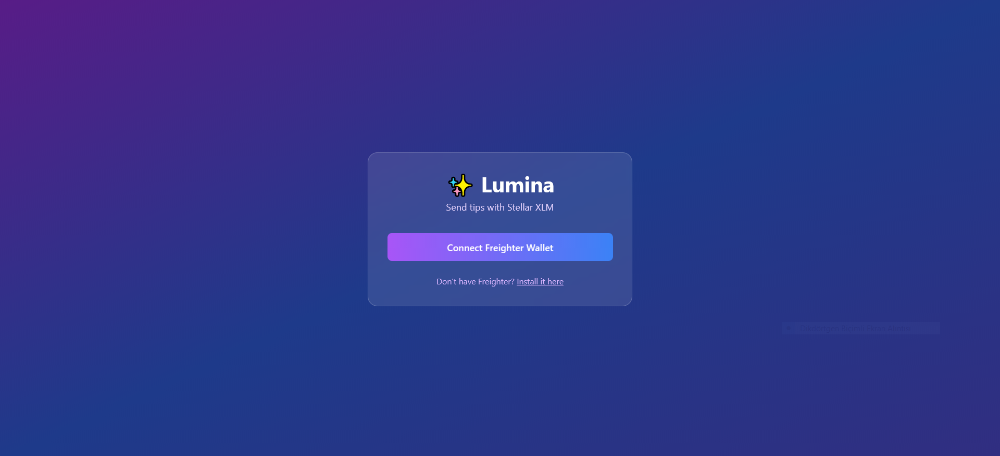
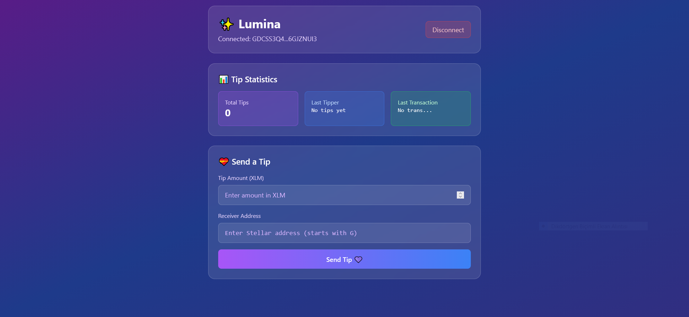
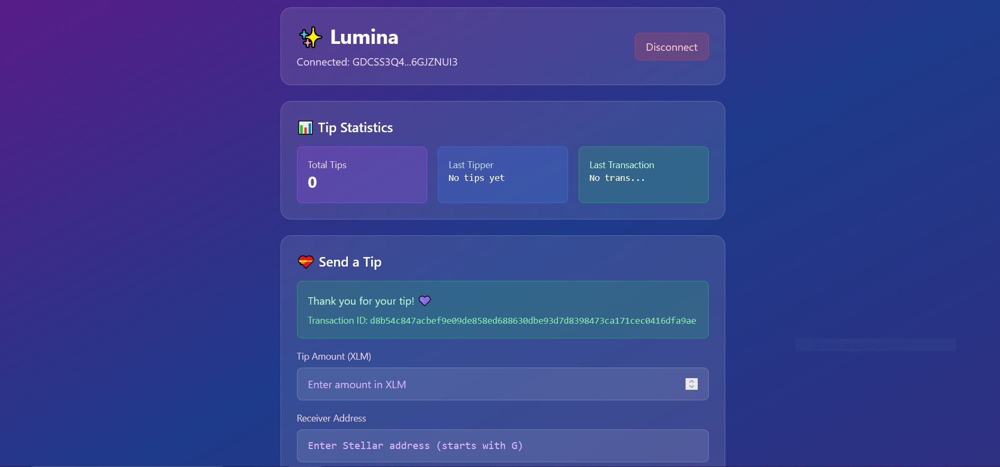

# ✨ Lumina - Stellar Tipping dApp

A minimalist decentralized application (dApp) for sending tips to content creators using Stellar XLM. Built with Next.js, TypeScript, Tailwind CSS, and Stellar Soroban smart contracts.

## 🖼️ Preview

<p align="center">
  <br/>
  <em>Connect your Freighter wallet to start tipping.</em>
</p>

<p align="center">
  <br/>
  <em>Dashboard showing tip statistics and send form.</em>
</p>

<p align="center">
  <br/>
  <em>Transaction confirmation displayed after sending a tip.</em>
</p>

---

## 🎯 Features

- **Freighter Wallet Integration** - Connect and sign transactions with Freighter
- **Simple Tipping UI** - Clean interface for sending XLM tips
- **Smart Contract Integration** - Records tips on Stellar Soroban
- **Real-time Statistics** - Track total tips and last tipper
- **Transaction History** - View transaction IDs and confirmations

## :purple_heart: To Send Tips: [lumina-pink.vercel.app](https://lumina-pink.vercel.app/)

## 🔗 Deployed Contract (Testnet)

| Item | Link |
|------|------|
| **Contract Address** | `CAV5N3NUKQD57H3ME4SH7QJ6KAGYTTFTZS6B2J3CV6MDNQIKSYCTBBVG` |
| **Contract** | [View on Stellar Expert](https://stellar.expert/explorer/testnet/contract/CAV5N3NUKQD57H3ME4SH7QJ6KAGYTTFTZS6B2J3CV6MDNQIKSYCTBBVG) |
| **Deployment Tx** | `b4753385707262f7dbd27bce6cd5f6ed7ad0d698ea0258a69cc1325928934fc0` |
| **Transaction** | [View on Stellar Expert](https://stellar.expert/explorer/testnet/tx/b4753385707262f7dbd27bce6cd5f6ed7ad0d698ea0258a69cc1325928934fc0) |

---

## 🛠 Tech Stack

- **Frontend**: Next.js 14, TypeScript, Tailwind CSS
- **Blockchain**: Stellar SDK, Soroban Smart Contracts
- **Wallet**: Freighter API
- **Network**: Stellar Testnet

## 🚀 Quick Start

### Prerequisites

- Node.js 18+ 
- Rust (for contract development)
- Freighter Wallet (install from [freighter.app](https://freighter.app/))
- Stellar CLI (for contract deployment)

### Installation

1. **Clone and install dependencies:**
```bash
git clone <your-repo>
cd Lumina
npm install
```

## 🚀 Deployment Guide

### Smart Contract Deployment (Stellar Testnet)


1. **Setup Stellar CLI:**
```bash
# Install Rust and WASM target
rustup target add wasm32-unknown-unknown

# Install Stellar CLI
cargo install --locked stellar-cli

# Generate keypair and fund with test XLM
stellar keys generate --alias alice
# Copy public key and get test XLM from: https://laboratory.stellar.org/#account-creator?network=test
```

2. **Build and Deploy Contract:**
```bash
cd contract
cargo build --target wasm32-unknown-unknown --release

# Deploy to Stellar Testnet
stellar contract deploy \
  --wasm target/wasm32-unknown-unknown/release/lumina_contract.wasm \
  --source alice \
  --network testnet \
  --alias lumina_contract
```

3. **Update Frontend:**
   - Copy the returned Contract ID
   - Update `app/services/contractService.ts`:
   ```typescript
   export const CONTRACT_ID = 'YOUR_CONTRACT_ID_HERE'
   ```

### Frontend Deployment (Vercel)

1. **Local Build Test:**
```bash
npm install
npm run build
```

2. **Deploy to Vercel:**
```bash
# Install Vercel CLI
npm i -g vercel

# Deploy
vercel --prod
```

3. **Optional: Connect GitHub for auto-deploy**
   - Link your GitHub repository in Vercel dashboard
   - Every push to main branch will auto-deploy

### Production Checklist
- [ ] Contract deployed to Stellar Testnet
- [ ] Contract ID updated in frontend
- [ ] Frontend deployed to Vercel
- [ ] Test tip functionality with Freighter wallet
- [ ] Verify transaction on Stellar Explorer

4. **Run the development server:**
```bash
npm run dev
```

5. **Open your browser:**
   - Navigate to [http://localhost:3000](http://localhost:3000)
   - Connect your Freighter wallet
   - Start tipping! 💜

## 📁 Project Structure

```
## 📦 Project Structure

```
Lumina/
├── app/                          # Next.js app directory
│   ├── layout.tsx               # Root layout
│   ├── page.tsx                 # Main connect page
│   └── services/
│       └── contractService.ts   # Soroban contract interactions
├── contract/                     # Rust Soroban smart contract
│   ├── src/lib.rs               # Contract logic
│   └── Cargo.toml
├── tailwind.config.js           # Tailwind CSS config
├── postcss.config.js            # PostCSS config
├── next.config.js               # Next.js config
├── vercel.json                  # Vercel deployment config
└── README.md
```

## 🔧 Smart Contract Functions

- `send_tip(sender, receiver, amount, tx_id)` - Records a tip transaction
- `get_total_tipped()` - Returns total number of tips sent  
- `get_last_tipper()` - Returns address of last tipper
- `get_last_tx_id()` - Returns transaction ID of last tip
- `get_tip(index)` - Returns tip data by index

## 💡 How It Works

1. **Connect**: User connects Freighter wallet on the landing page
2. **Tip**: User enters tip amount and receiver address
3. **Sign**: Freighter signs the XLM payment transaction
4. **Submit**: Transaction is submitted to Stellar network
5. **Record**: Tip data is stored in the Soroban contract
6. **Display**: Success message and transaction ID are shown

## 🧪 Testing

The dApp is designed to work on Stellar Testnet:

- Get test XLM from [Stellar Laboratory](https://laboratory.stellar.org/#account-creator?network=test)
- Use testnet addresses (starting with 'G')
- All transactions are on testnet - no real money involved

## 📚 Documentation

- [Freighter Wallet Docs](FreighterWalletDocs.md)
- [Stellar Deployment Guide](StellarDeploy.md)
- [Product Requirements](pdr.md)
- [Vercel Deployment Guide](DEPLOYMENT.md)

## 🤝 Contributing

This is a minimal MVP focused on core functionality. The codebase is intentionally simple to demonstrate basic Stellar dApp development.

## 📄 License

MIT License - feel free to use this as a starting point for your own projects!

---

**Built with 💜 for the Stellar ecosystem**

